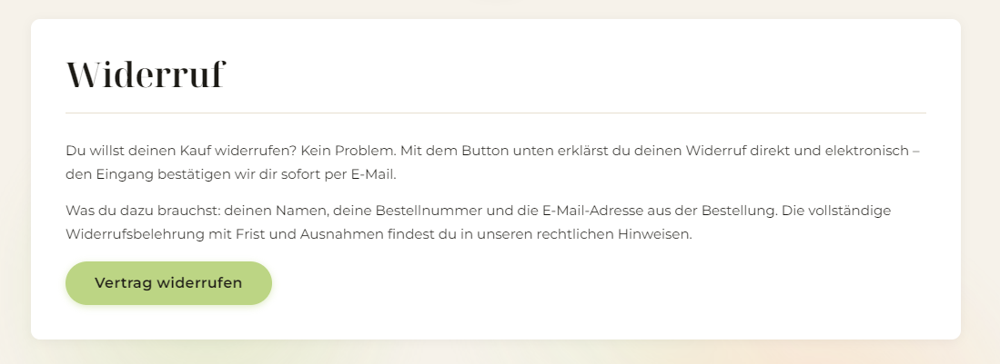
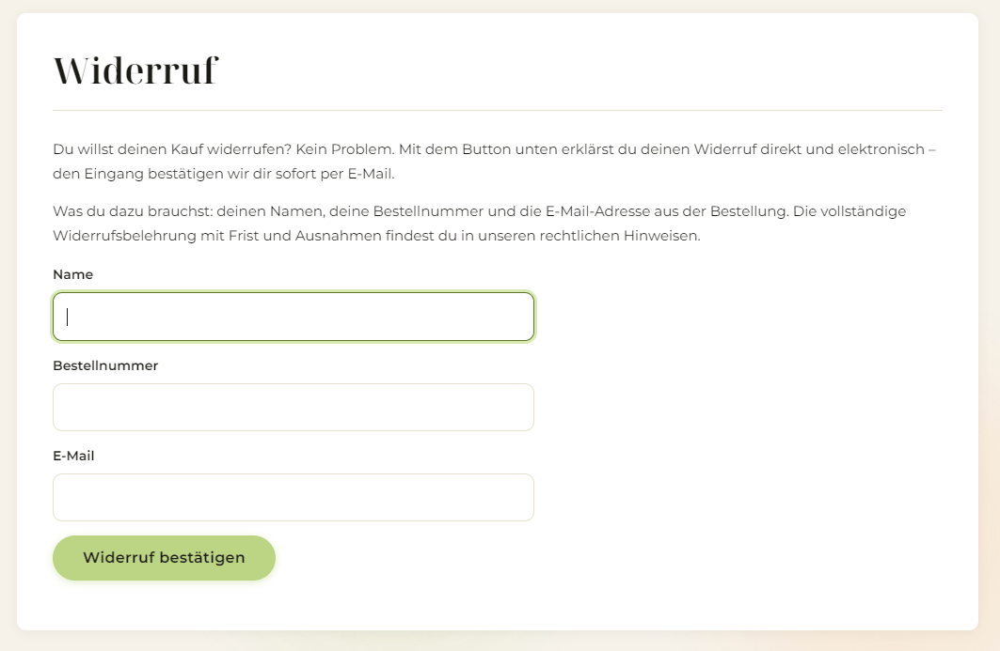
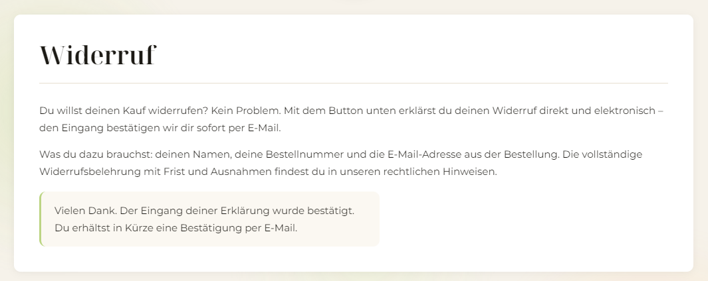
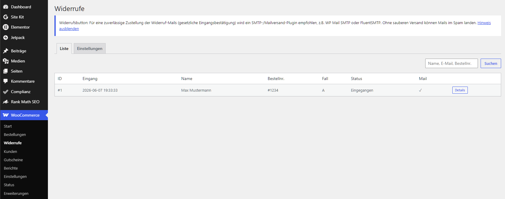
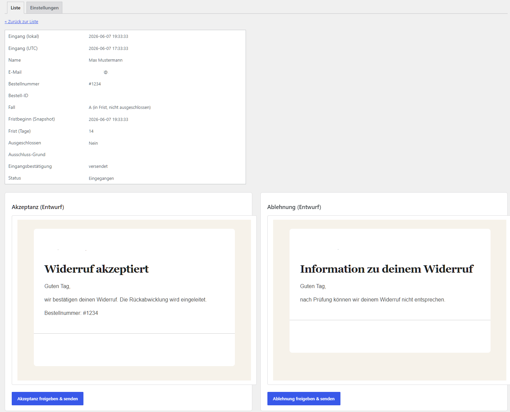
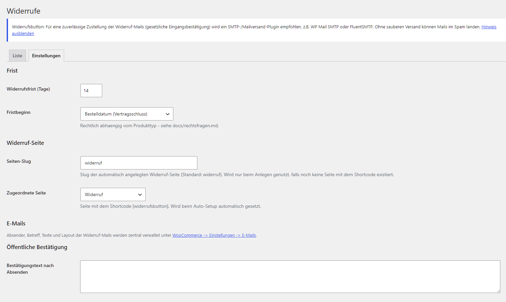
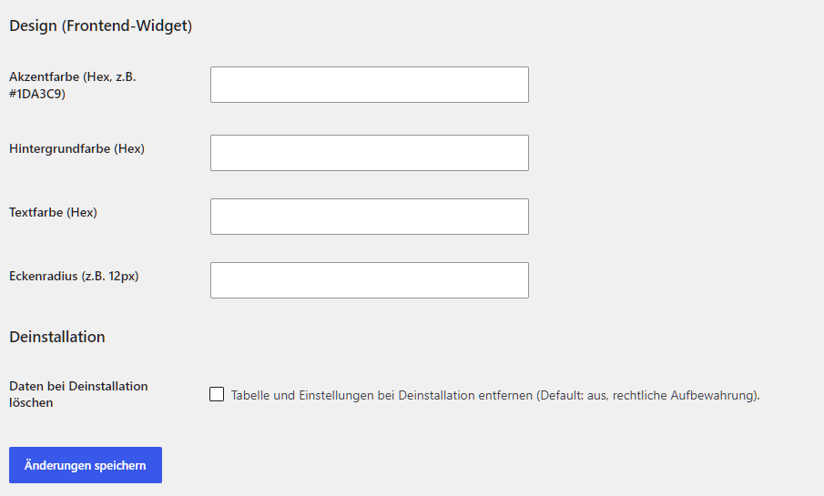

# Widerrufsbutton fuer WooCommerce

[](https://www.gnu.org/licenses/gpl-2.0.html)


Kostenloses Open-Source-Plugin fuer den **ab 19.06.2026 gesetzlich verpflichtenden
elektronischen Widerrufsbutton** in WooCommerce (EU-Richtlinie 2023/2673,
Paragraf 312k BGB).

Ab diesem Stichtag muss jeder Online-Shop in der EU, der Verbrauchern
Vertragsabschluesse per Button ermoeglicht, auch einen ebenso einfachen
**Widerrufsbutton** anbieten. Dieses Plugin liefert genau das - sauber, schlank
und ohne Abo.

---

## Was das Plugin macht

- **Zweistufiger Widerruf-Flow** ueber Shortcode `[widerrufsbutton]`: Button ->
  Formular (Name, Bestellnummer, E-Mail) -> neutrale Bestaeti gungsseite.
- **Automatische, neutrale Eingangsbestaetigung** per E-Mail mit Datum und Uhrzeit
  (gesetzliche Pflicht).
- **Keine automatische Entscheidung.** Akzeptanz und Ablehnung werden als Entwurf
  vorbereitet und im Backend per 1-Klick freigegeben. Nur die Eingangsbestaetigung
  geht automatisch raus.
- **Benachrichtigung an den Shop-Betreiber** bei jedem neuen Widerruf (Empfaenger
  konfigurierbar, Direktlink zur Freigabe).
- **Native WooCommerce-Mails:** Absender, Betreff, Texte und Layout aller vier
  Widerruf-Mails laufen ueber WooCommerce -> Einstellungen -> E-Mails.
- **Automatisches Setup:** legt bei Aktivierung eine Seite mit dem Shortcode an
  (Slug konfigurierbar, keine Duplikate).
- **Fallbasierte Vorklassifizierung (A/B/C)** je nach Frist und Ausschluss.
- **Produkt-Flag** "Vom Widerruf ausgeschlossen" inkl. Begruendung (z.B. digitale
  Sofort-Downloads).
- **Sicherer Bestell-Abgleich** ohne Enumeration (Bestellnummer + E-Mail,
  Rate-Limiting, immer neutrale Antwort).
- **HPOS-konform**, eigene Custom Table - updatesicher, kein Custom Post Type.
- **White-Label:** Frontend-Farben und Eckenradius pro Shop konfigurierbar ueber
  CSS-Custom-Properties. Keine festen Markenfarben im Code.

---

## Screenshots

**Frontend-Button** — erscheint auf der Widerruf-Seite per Shortcode:



**Formular** — oeffnet sich nach Klick auf den Button:



**Bestaetigung** — neutrale Rueckmeldung nach dem Absenden:



**Admin-Liste** — alle eingegangenen Widerrufe auf einen Blick:



**Admin-Detail** — Metadaten + Entwuerfe fuer Akzeptanz und Ablehnung mit 1-Klick-Freigabe:



**Admin-Einstellungen** — Frist, Widerruf-Seite, Mails:



**White-Label-Design** — Frontend-Farben und Eckenradius pro Shop konfigurierbar:



---

## Schnellstart mit KI (empfohlen)

Du musst das nicht selbst einbauen. Gib einem KI-Coding-Assistenten wie
**Claude Code** (oder einem vergleichbaren Tool mit Zugriff auf deine
WordPress-Installation) einfach diesen Prompt:

```text
Installiere das WordPress-Plugin aus dem Repository
https://github.com/m-entruencer/widerrufsbutton-woocommerce auf meiner WordPress-Seite.
Aktiviere es und passe die Farben des Plugins (WooCommerce -> Widerrufe -> Einstellungen)
an das bestehende Design meiner Website an. Fuge anschliessend einen Link "Widerruf"
in den Footer ein.
```

Das war es. Der Assistent erledigt Installation, Aktivierung, Seitenanlage,
Design-Anpassung und Footer-Link in einem Rutsch. Genau so ist dieses Plugin
das erste Mal live gegangen.

> Tipp: Den Stichtag 19.06.2026 nicht verschlafen - der Einbau dauert mit KI nur
> wenige Minuten.

---

## Manuelle Installation

1. Neuestes ZIP von der [Releases-Seite](https://github.com/m-entruencer/widerrufsbutton-woocommerce/releases)
   laden und unter **Plugins -> Installieren -> Plugin hochladen** einspielen.
   Alternativ den Ordner nach `wp-content/plugins/widerrufsbutton-wc/` kopieren.
2. Plugin aktivieren. Dabei werden die Custom Table und automatisch eine Seite
   "Widerruf" mit dem Shortcode `[widerrufsbutton]` angelegt. Ein `composer install`
   ist **nicht** noetig - ein Autoloader-Fallback ist eingebaut.
3. Optional: Mails (Absender, Betreff, Texte, Layout) unter
   **WooCommerce -> Einstellungen -> E-Mails** anpassen. Fuer zuverlaessige Zustellung
   ein SMTP-/Mailversand-Plugin nutzen.
4. Optional: Unter **WooCommerce -> Widerrufe -> Einstellungen** Frist, Widerruf-Seite
   (Slug) und Frontend-Design pflegen.

**Voraussetzungen:** WordPress 6.4+, PHP 8.1+, WooCommerce 8.0+ (HPOS empfohlen).

---

## Anpassung & White-Label

Frontend-Farben und Eckenradius sind per CSS-Custom-Properties konfigurierbar
(`--wrb-accent`, `--wrb-bg`, `--wrb-text`, `--wrb-radius`). Mail-Inhalte (Absender,
Betreff, Texte) werden ueber die nativen WooCommerce-Mail-Einstellungen gepflegt.
Templates sind im Theme ueberschreibbar, fuer Entwickler gibt es Filter-Hooks.

Vollstaendige Referenz: **[docs/anpassung.md](docs/anpassung.md)**.
Technische Architektur: **[docs/architecture.md](docs/architecture.md)**.
Funktionale Spezifikation: **[docs/spec.md](docs/spec.md)**.

---

## ZIP selbst bauen

```powershell
.\build-zip.ps1
```

Erzeugt `widerrufsbutton-wc-<version>.zip` mit korrekten Forward-Slash-Pfaden
(linuxtauglich, im Gegensatz zu `Compress-Archive`).

---

## Haftungsausschluss

Dieses Plugin wird **ohne jede Gewaehr** bereitgestellt (siehe GPL-Lizenz). Es
stellt **keine Rechtsberatung** dar und garantiert **keine Rechtskonformitaet** im
konkreten Einzelfall. Ob und wie der Widerrufsbutton fuer deinen Shop umzusetzen
ist, haengt von deinem konkreten Geschaeftsmodell ab. Pruefe die Eignung selbst und
lass die Umsetzung im Zweifel von einer auf IT-Recht spezialisierten Stelle
bestaetigen. Die Nutzung erfolgt auf eigenes Risiko.

---

## Mitwirken

Issues und Pull Requests sind willkommen. Das Plugin ist bewusst schlank gehalten -
Beitraege, die es einfach und rechtssicher halten, sind besonders gern gesehen.

---

## Lizenz & Credits

GPL-2.0-or-later. Bereitgestellt von der **[Entruencer UG (haftungsbeschraenkt)](https://entruencer.de/)**
als Beitrag zur WooCommerce-Community.
